# 01. Архитектура

Обзор ключевых систем шаблона. Подробности по каждой — в отдельных документах.

## Общая идея

- **Singletons** — для долгоживущих менеджеров (`GameManager`, `SceneLoader`, `AudioManager`, `SaveManager`, `PauseService`, `UIManager`). Все они лежат на префабе `_Managers.prefab` и переживают смену сцен через `DontDestroyOnLoad` (это делает `GameBootstrapper`).
- **ScriptableObject EventChannels** — для развязки систем. Вместо прямых ссылок «UI → геймплей» обе стороны подписываются на один и тот же SO-ассет.
- **UIScreen/UIManager-стек** — вся UI-навигация делается через `Push/Pop/Replace`.

## Поток запуска

```mermaid
flowchart LR
    boot["00_Bootstrap"] --> managersInst["Instantiate _Managers prefab"]
    managersInst --> dontDestroy["DontDestroyOnLoad"]
    dontDestroy --> loadMenu["SceneLoader.LoadMainMenu"]
    loadMenu --> mainMenu["01_MainMenu"]
    mainMenu -->|"Play"| loadGame["SceneLoader.LoadGame"]
    loadGame --> game["02_Game"]
    game --> gameOver["GameManager.GameOver"]
    gameOver --> endScreen["EndGameScreen overlay"]
    endScreen -->|"Main Menu"| loadMenu
```



## Менеджеры (на префабе `_Managers.prefab`)

| Менеджер | Обязанности |
|---|---|
| `GameManager` | Текущее `GameState` (Boot/MainMenu/Loading/Playing/Paused/GameOver/Victory), счёт, «начать игру», «game over». |
| `SceneLoader` | Асинхронная загрузка сцен с минимальной задержкой, события `OnLoadStart`/`OnLoadComplete`. |
| `AudioManager` | Пул источников SFX, кроссфейд музыки, чтение/запись громкостей через AudioMixer. |
| `SaveManager` | Обёртка над `PlayerPrefs`: громкости, fullscreen, best score. |
| `PauseService` | `Time.timeScale = 0`, события `OnGamePaused`/`OnGameResumed`. |
| `UIManager` | Стек `UIScreen`, методы `Push`/`Pop`/`Replace`, `Register`/`Find<T>`. |

Каждый менеджер — `Singleton<T>` (базовый класс в [`Assets/_Project/Scripts/Core/Singleton.cs`](../Scripts/Core/Singleton.cs)). Доступ: `SceneLoader.Instance.LoadGame()`. Проверка, что синглтон создан: `SceneLoader.HasInstance`.

## ServiceLocator

Есть ещё [`ServiceLocator.cs`](../Scripts/Core/ServiceLocator.cs) — для случаев, когда нужна развязка интерфейсами (например, мок-реализация). В обычном флоу используем синглтоны; ServiceLocator доставай, когда действительно нужен DI-подобный паттерн.

## Event Channels

См. [`03_События_EventChannels.md`](03_События_EventChannels.md). Готовые каналы:

- `OnGameStateChanged` (`GameStateEventChannelSO`)
- `OnScoreChanged` (`IntEventChannelSO`)
- `OnGamePaused`, `OnGameResumed`, `OnLoadStart`, `OnLoadComplete` (`VoidEventChannelSO`)

Ассеты лежат в `Assets/_Project/ScriptableObjects/EventChannels/`.

## UI

См. [`02_UI_экраны.md`](02_UI_экраны.md). Все экраны наследуются от `UIScreen`; `UIManager` держит стек и управляет показом/скрытием.

## Структура кода

```
Assets/_Project/Scripts/
  Core/         Singleton · GameBootstrapper · ServiceLocator · ObjectPool
  Managers/     GameManager · SceneLoader · AudioManager · SaveManager · PauseService · AudioCueSO · GameState
  Events/       VoidEventChannelSO · IntEventChannelSO · FloatEventChannelSO · StringEventChannelSO · GameStateEventChannelSO
  UI/           UIScreen · UIManager · MainMenuScreen · SettingsScreen · PauseScreen · HUDScreen · EndGameScreen · LoadingScreen · PauseInputWatcher
  Input/        InputReader (SO) + InputSystem_Actions.inputactions
  Gameplay/     (пусто — твой игровой код)
  Editor/Setup/ TemplateSetup · TemplateSceneSetup (инструменты меню Tools)
  Utilities/    (твои хелперы)
```

## Инварианты, которые нельзя ломать

1. Префаб `_Managers.prefab` инстанцируется **только** `GameBootstrapper`-ом в `00_Bootstrap`. Не класть его руками в другие сцены.
2. Каждый экран UI — это отдельный GameObject с `CanvasGroup` и скриптом-наследником `UIScreen`.
3. Доступ к громкости — **только** через `AudioManager.Set*Volume`. Не лезь в `AudioMixer.SetFloat` из других мест.
4. Пауза — **только** через `PauseService.Pause/Resume/Toggle`. Не трогай `Time.timeScale` напрямую.
